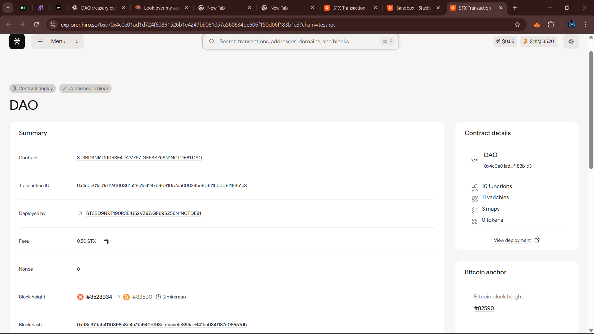

# DAO Treasury Contract

## Project Description

The DAO Treasury Contract is a decentralized autonomous organization (DAO) treasury management system built on the Stacks blockchain using Clarity smart contracts. This contract enables community-driven decision making for fund allocation through a proposal and voting mechanism. DAO members can create funding proposals, vote on them, and execute approved proposals automatically when they meet the required voting threshold.

Key features include:
- **Proposal Creation**: DAO members can submit funding proposals with recipient, amount, and description
- **Democratic Voting**: Members vote on proposals to determine fund allocation
- **Automatic Execution**: Proposals that meet the voting threshold can be executed to transfer funds
- **Treasury Management**: Secure handling of community funds with transparent balance tracking
- **Membership Control**: Owner-managed DAO membership system

## Project Vision

Our vision is to democratize treasury management by providing a transparent, trustless, and community-driven platform for fund allocation. We aim to eliminate centralized control over community resources and enable truly decentralized decision-making processes. The DAO Treasury Contract serves as a foundation for building autonomous communities that can efficiently manage shared resources while maintaining full transparency and accountability.

By leveraging blockchain technology, we ensure that every proposal, vote, and fund transfer is permanently recorded and verifiable, creating an immutable audit trail that builds trust within the community.

## Future Scope

### Phase 1 - Enhanced Voting System
- **Weighted Voting**: Implement token-based voting power where voting strength correlates with token holdings
- **Quadratic Voting**: Introduce quadratic voting mechanisms to prevent whale dominance
- **Time-locked Voting**: Add proposal voting periods with automatic closure after specified duration
- **Delegation System**: Allow members to delegate their voting power to trusted representatives

### Phase 2 - Advanced Governance Features
- **Multi-signature Requirements**: Implement multi-sig requirements for large fund transfers
- **Proposal Categories**: Create different proposal types (grants, investments, operational expenses)
- **Budget Allocation**: Implement periodic budget cycles with predefined allocation limits
- **Emergency Procedures**: Add emergency pause and fund recovery mechanisms

### Phase 3 - Integration & Ecosystem
- **Cross-chain Compatibility**: Extend functionality to support multi-chain treasury management
- **DeFi Integration**: Connect with DeFi protocols for yield generation on idle treasury funds
- **NFT Support**: Add support for NFT-based membership and voting rights
- **Analytics Dashboard**: Develop comprehensive reporting and analytics tools

### Phase 4 - Advanced Features
- **AI-powered Insights**: Implement AI analysis for proposal evaluation and risk assessment
- **Automated Recurring Payments**: Support for salary and subscription-based fund transfers
- **Compliance Framework**: Add regulatory compliance features for institutional adoption
- **Mobile Application**: Develop user-friendly mobile interface for proposal management

---

### Quick Start Guide

1. **Deploy Contract**: Deploy the contract to Stacks blockchain
2. **Add Members**: Contract owner adds initial DAO members using `add-dao-member`
3. **Fund Treasury**: Community members deposit STX using `deposit-to-treasury`
4. **Create Proposals**: DAO members submit funding proposals using `create-proposal`
5. **Vote & Execute**: Members vote on proposals and execute approved ones

### Main Functions

- `create-proposal`: Submit new funding proposals
- `execute-proposal`: Execute approved proposals that meet voting threshold
- `vote-on-proposal`: Cast votes on active proposals
- `deposit-to-treasury`: Add funds to the treasury
- `add-dao-member`: Add new DAO members (owner only)
## Contract id:ST3BD9NRT190R3E4J52VZ97JGF69SZ56N1NCTDE81.DAO

## Screenshot:

